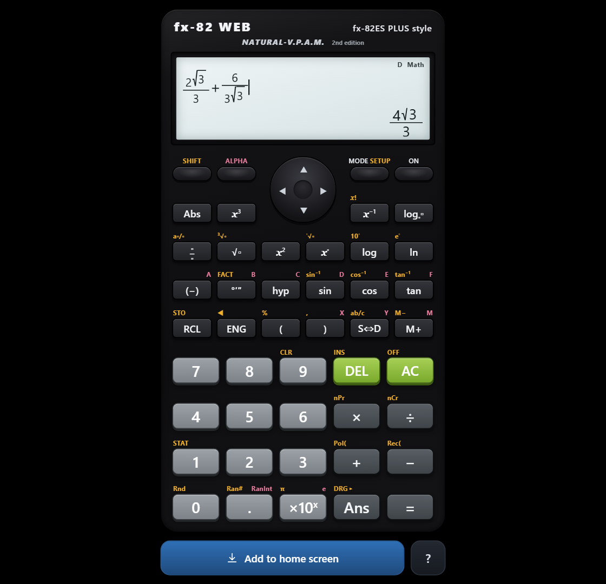

# Calculator

A scientific calculator with a **natural textbook display**: fractions are stacked, roots
have a radical that grows with what is under it, and answers come back exact - √8 gives
2√2, not 2.828427125. It is one HTML file with no dependencies, and it installs onto a
phone home screen and works with no network at all.

**Live:** https://sergeyitaly.github.io/calculator/



---

## Install it on your phone

Open the link above on the phone, then:

| | |
|---|---|
| **Android** (Chrome, Edge, Samsung Internet) | Tap **Install on phone** in the page, or the browser menu → **Install app**. |
| **iPhone / iPad** (Safari) | Tap **Share** → **Add to Home Screen** → **Add**. The in-page button shows these steps. |
| **Desktop** (Chrome, Edge) | Use the install icon in the address bar. |

Once installed it launches from the home screen like any other app, fills the screen
edge to edge, and runs offline — the service worker keeps a copy of the page, so it works on a
plane, in a basement, or in an exam room with no signal.

## What it does

* **Natural display.** Fractions are stacked, roots have a real radical sign that grows
  with what is under it, exponents are raised. The cursor walks into a numerator or under
  a root, the way the replay pad on a hardware calculator does.
* **The real priority table.** Implied multiplication binds tighter than `÷` in front of
  π, e, variables, Ans and functions — so `6÷2π` is `6/(2π)` — but *not* in front of a
  bracket, so `6÷2(1+2)` is `9` - which is what the priority table in a scientific
  calculator manual actually specifies.
* **Exact answers.** `√8` gives `2√2`, `1÷3` gives `1/3`, `π÷4` gives `π/4`, and
  `S⇔D` switches to the decimal. Answers stay exact only while every number typed in was
  a whole number, the same rule a hardware calculator applies.
* **Everything on the keys.** `x²` `x³` `x⁻¹` `x!` `x^` `ⁿ√` `log` `ln` `logₐb` `Abs`
  trig and hyperbolics with inverses, `°′″` degrees-minutes-seconds, `nPr` `nCr`, `Pol(`
  `Rec(`, `Ran#` `RanInt`, `ENG`, `Rnd`, `FACT` prime factorisation, nine memories
  (A–F, X, Y, M) with `STO`/`RCL`, `M+`/`M−`, and `Ans`.
* **MODE** — COMP, STAT (1-VAR and A+BX) and TABLE.
  **SETUP** (SHIFT MODE) — MthIO/LineIO, Deg/Rad/Gra, Fix/Sci/Norm, ab/c and d/c.
* **Help on SHIFT 7** - the key map and the notes below, without leaving the app. The
  footer button disappears once the app is installed, so the help lives on a key too.
* **Errors** behave as you would expect: `Math ERROR`, `Syntax ERROR`, and the arrows take
  you back to the expression.

### Hidden games

Tap the replay pad **up up down down left right left right**. A game menu appears on the
display: **1** for SNAKE, **2** for BRICKS. The pad steers, `=` pauses, `AC` goes back to
calculating.

### Computer keyboard

`0`–`9` `.` `+` `-` `*` `/` work as printed; `Enter` is `=`, `Backspace` is `DEL`,
`Esc` is `AC`, the arrow keys are the replay pad, and `s c t l n r f ^ ! ( ) a e p q i d`
give sin, cos, tan, log, ln, √, fraction, power, x!, brackets, Ans, ×10ˣ, π, x², x⁻¹, S⇔D.

## How it is built

| File | |
|---|---|
| `index.html` | The whole calculator: markup, styling, input model, parser, display. |
| `sw.js` | Service worker. Precaches the six files, serves them cache-first, refreshes in the background. |
| `manifest.webmanifest` | Name, icons, standalone display. |
| `test/` | Engine, UI and security tests. Plain Node, no dependencies. |
| `tools/csp.js` | Recomputes the Content-Security-Policy hashes for the inline script and style. |
| `tools/mkicons.js` | Draws the PNG icons. |

The expression on screen is not a string — it is a tree, so a fraction really contains two
sub-expressions and the cursor can be inside one of them. Evaluation walks that tree into
a token stream and then through a recursive-descent parser whose levels are the ones
printed in a scientific calculator's manual.

### Running the tests

```sh
npm test            # engine + UI + security, 140 assertions
npm run csp:check   # the CSP hashes still match index.html
```

If you edit `index.html`, run `npm run csp` afterwards to refresh the policy hashes, or
the page will refuse to run its own script.

## Security

No backend, no accounts, no analytics, no cookies, nothing stored about you, and nothing
loaded from another origin. See [SECURITY.md](SECURITY.md) for the specifics and how they
are enforced in CI.

## Licence

MIT — see [LICENSE](LICENSE).

Written from scratch: no code, artwork, firmware or assets from any calculator maker are
used or reproduced here, and the project is not affiliated with or endorsed by any
hardware manufacturer.
